# Cyber security project - Secondhand marketplace

A web application demonstrating common security vulnerabilities from the OWASP Top 10 list. This project is built with Django (backend) and Vue.js (frontend).

More information about the OWASP Top 10 vulnerabilities: [OWASP Top 10 (2025)](https://owasp.org/Top10/2025/)

## Installation and setup

### Prerequisites

The following software must be installed on your system:

- **Python 3.11+** - [Download Python](https://www.python.org/downloads/)
- **Node.js 18+** and npm - [Download Node.js](https://nodejs.org/)

### Installation steps

#### 1. Clone the repository

```bash
git clone https://github.com/jasminlei/cyber-security-project.git
cd cyber-security-project
```

#### 2. Backend setup (Django)

Navigate to the server directory:

```bash
cd server
```

**Install Python dependencies:**

```bash
pip install -r requirements.txt
```

> If you encounter issues with `pip`, try using `python -m pip install -r requirements.txt`

**Run database migrations:**

```bash
python manage.py migrate
```

- **Windows:** Use `python` instead of `python3`
- **macOS/Linux:** Use `python3` if you have both Python 2 and 3 installed

**Start the Django development server:**

```bash
python manage.py runserver
```

The backend will be available at `http://localhost:8000`

#### 3. Frontend setup (Vue.js)

Open a new terminal window and navigate to the client directory:

```bash
cd client
```

**Install Node.js dependencies:**

```bash
npm install
```

**Start the Vue development server:**

```bash
npm run dev
```

The frontend will be available at `http://localhost:5173`

## Creating a user account

1. Open `http://localhost:5173` in your browser
2. Click "Login" in the navigation bar
3. Change to "Register"
4. Fill in the registration form:
   - Username
   - Email
   - Password
   - Confirm Password
5. Click "Register"
6. You will be automatically logged in

## Using the application

### Browse items

- Click "Browse" to view all marketplace items
- Use the search box to filter items
- Click on any item to view details

### Create a new item

- Click "Add Item" (requires login)
- Fill in the form:
  - Title
  - Description
  - Price
  - Contact information
  - Image URL (optional)
- Click "Create Item"

### Manage your items

- Click "My Items" to see items you've created
- View, edit, or delete your own items

### Like items

- Click the heart icon on any item

## Security flaws

This project intentionally contains 5 common security flaws from the OWASP Top 10. Each flaw is present in the codebase, and there is a commented-out fix for the problem below the actual flaw.

### 1. Broken Access Control (A01)

**Location:** `server/items/views.py` (class `ItemDetailView`)

**Description:** Any authenticated user can delete or edit any item, even if they don't own it. No ownership check is performed.

**Before fix:**
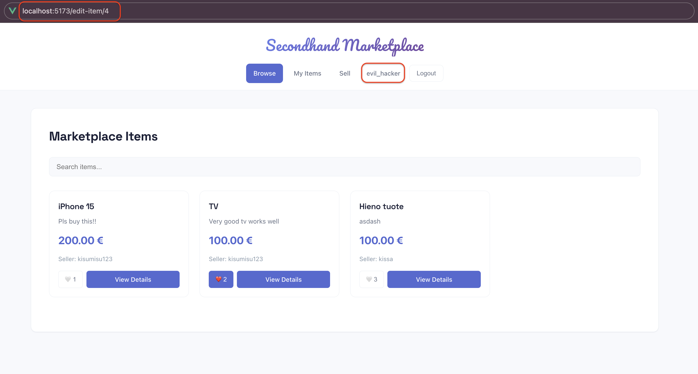
_User can navigate to edit-item page for items that they don't own_

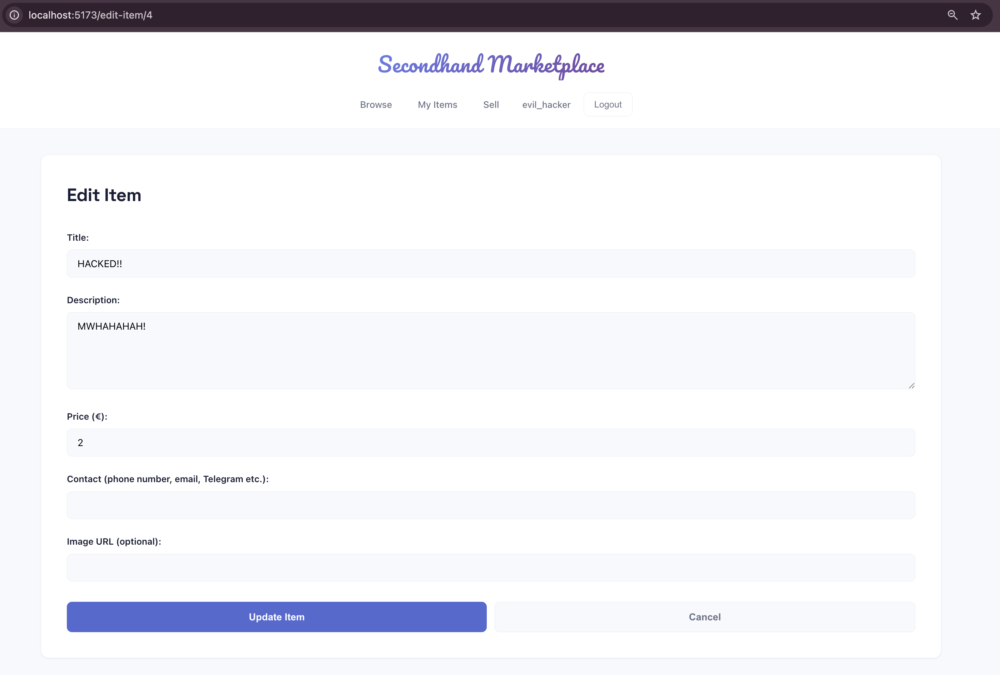
_User can edit another users item_

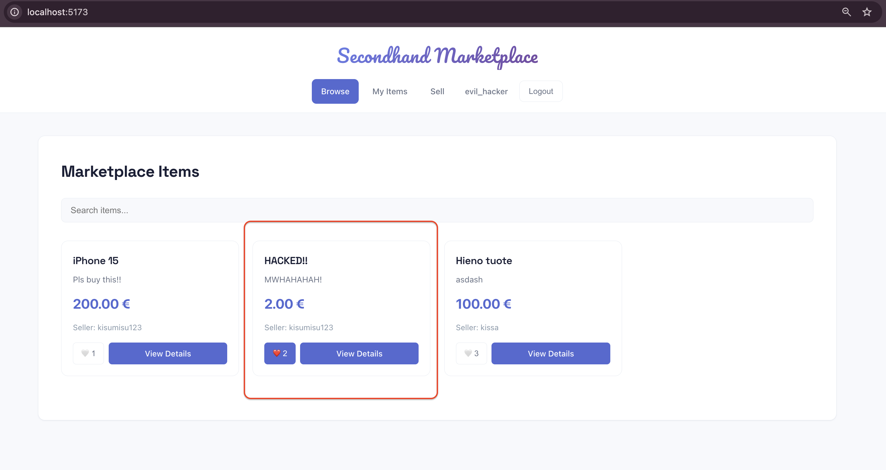
_Edited item is shown in the item listing_

**After fix:**
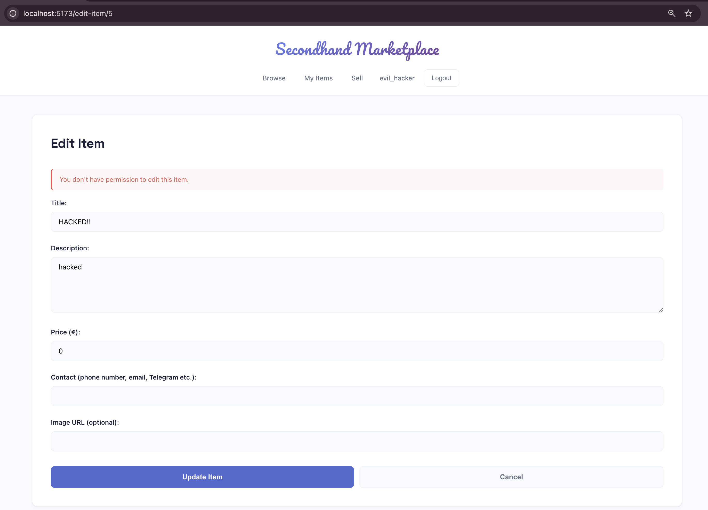
_Permission denied, only owner can edit_

---

### 2. Security Misconfiguration (A05)

**Location:** `server/backend/settings.py` and `server/backend/urls.py`

**Description:** `DEBUG = True` exposes sensitive information like stack traces, local variables, and database credentials when errors occur. Visit `http://localhost:8000/test-error/` to see the vulnerability.

**Before fix (DEBUG=True):**
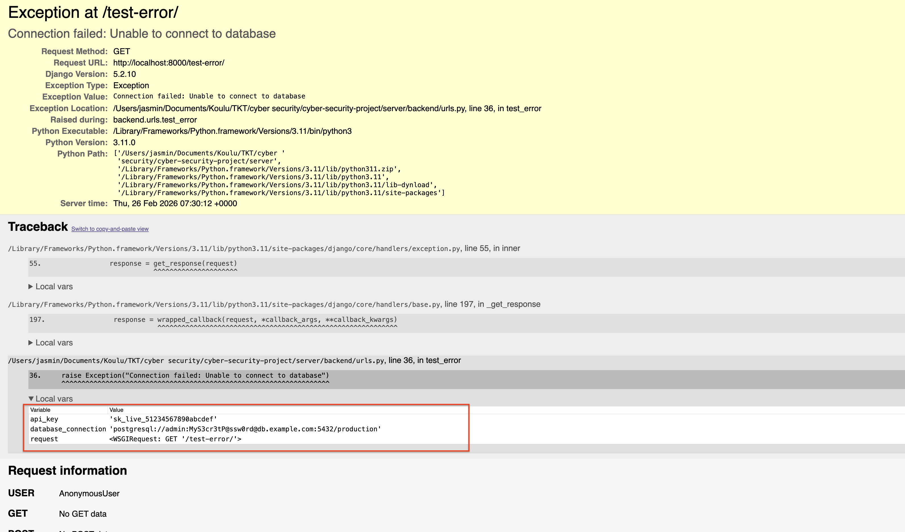
_Detailed error page shows sensitive data: database credentials, API keys, file paths_

**After fix (DEBUG=False):**
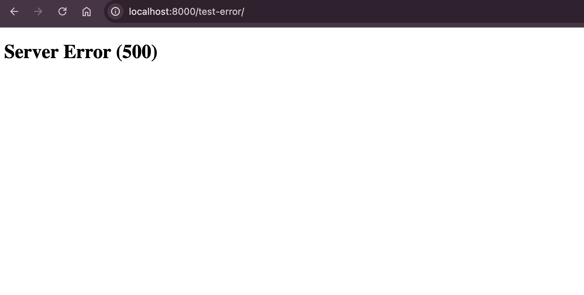
_Generic error page hides sensitive information_

---

### 3. Injection - Stored XSS (A03)

**Location:** `server/items/serializers.py` (backend) and `client/src/components/ItemDetail.vue` (frontend)

**Description:**

- **Backend:** No validation or sanitization of HTML in description field. Malicious scripts are stored directly in the database.
- **Frontend:** User input is rendered using `v-html`, allowing JavaScript execution.

This is a stored XSS vulnerability, the malicious code is permanently stored on the server and executed whenever someone views the item.

**Before fix:**
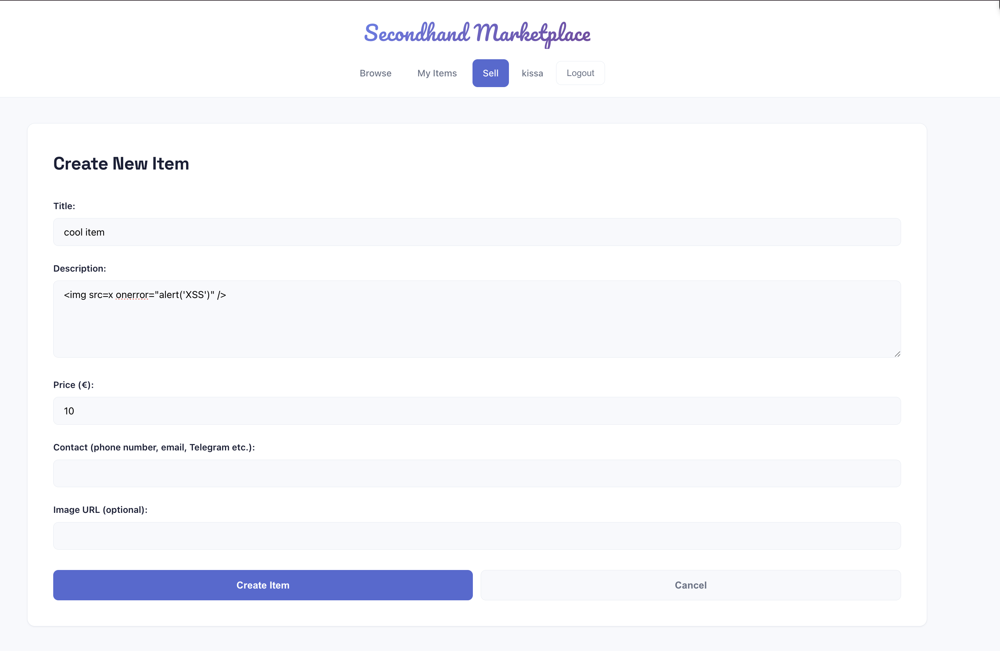
_Creating item with XSS payload: ``, backend accepts it without validation_

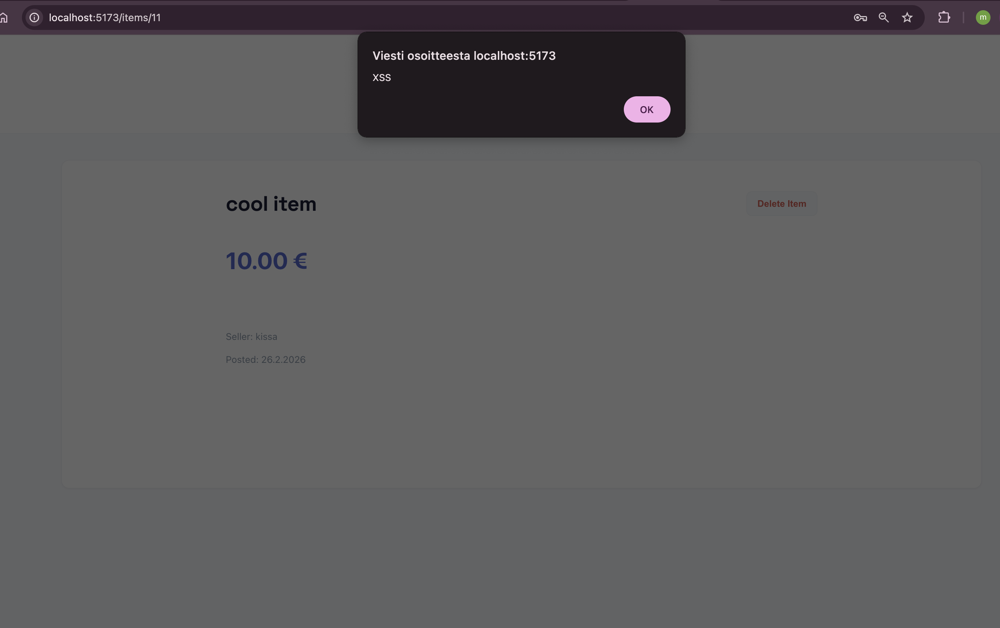
_XSS alert executes when viewing the item and stored payload runs on every view_

**After fix:**
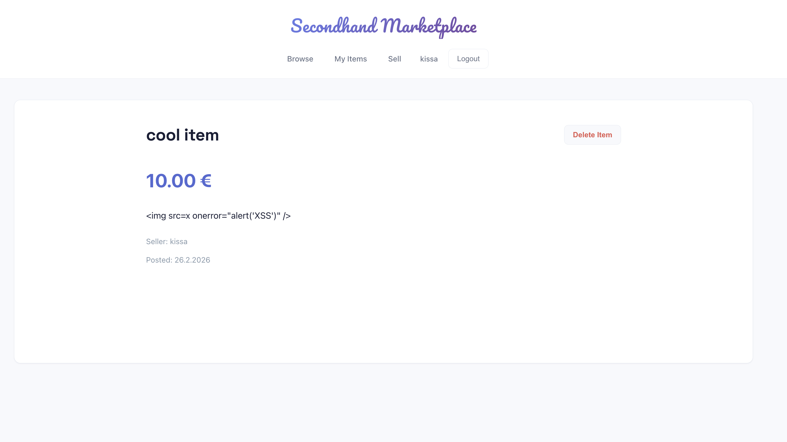
_Backend rejects HTML tags, no script execution_

---

### 4. Weak Password Policy (A07)

**Location:** `server/users/serializers.py` (class `RegisterSerializer`)

**Description:** No requirements for the password (uppercase, numbers, special characters).

**Before fix:**
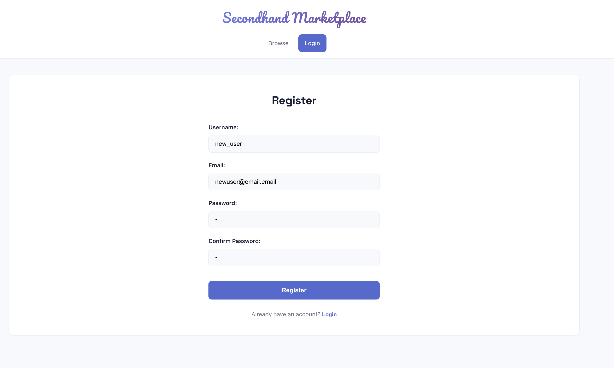
_User can register with weak password with only 1 character_

**After fix:**
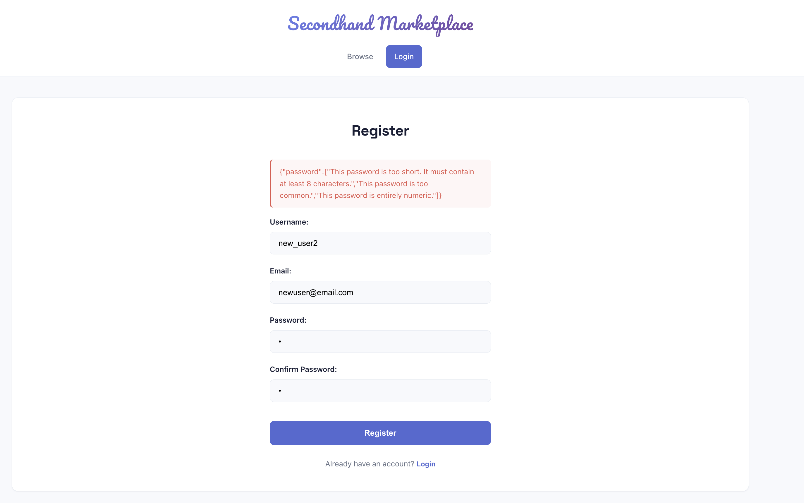
_Password rejected: must include uppercase, lowercase, numbers, and special characters_

---

### 5. Security Logging and Monitoring Failures (A09)

**Location:** `server/users/views.py` (class `LoginView`)

**Description:** Only successful logins are logged. Failed login attempts are not logged, allowing attackers to perform brute-force attacks undetected.

**Before fix:**
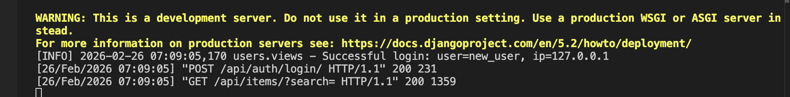
_Terminal shows only successful logins_

**After fix:**
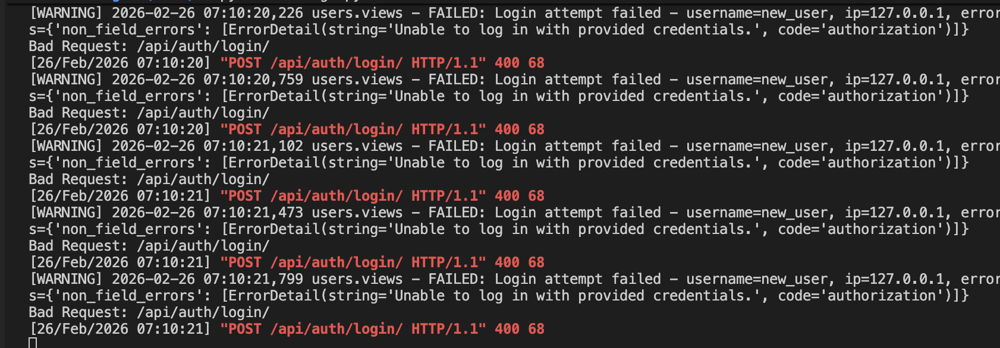
_Terminal logs both successful and failed login attempts with usernames and IP addresses_
